*NOTE:* This file is a template that you can use to create the README for your project. The *TODO* comments below will highlight the information you should be sure to include.


# Your Project Title Here

*TODO:* Write an overview to your project.

In this project we are provided a dataset: the Bank marketing dataset. We use automl to determined the best performing model, which can be used to predict whether or not the clients end up subscribing to the product being advertised by the bank. We deploy
this model, so that it can used by others to work with on this dataset. We make sure to enable logging so that we can track what goes with our deployed model for debugging purposes.

## Architectural Diagram
*TODO*: Provide an architectual diagram of the project and give an introduction of each step.

Here is an architectural view of the project:
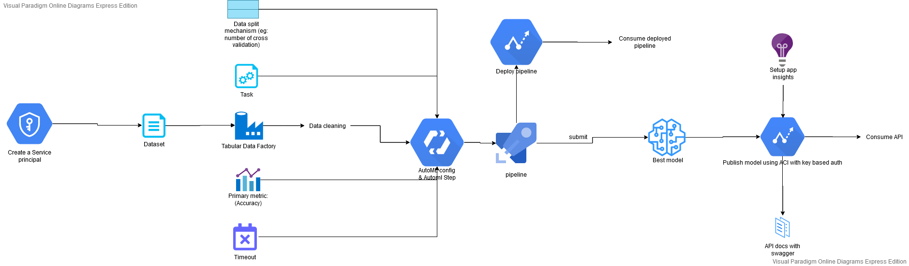


## Key Steps
*TODO*: Write a short discription of the key steps. Remeber to include all the screencasts required to demonstrate key steps.


### Creating a service principal
We kickstart by creating an service principal. We first install ``az`` command line tool and also the ``azure-cli-ml`` extension to it. We login and then create a ``service principal``:

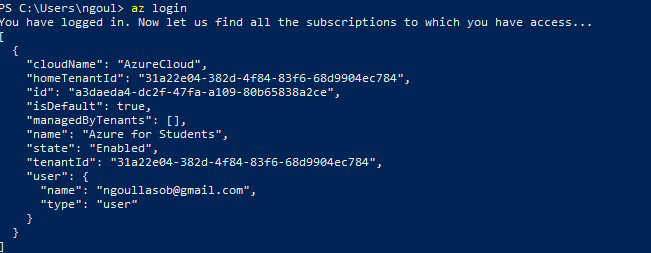

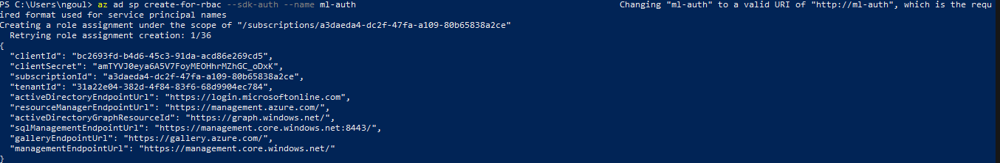
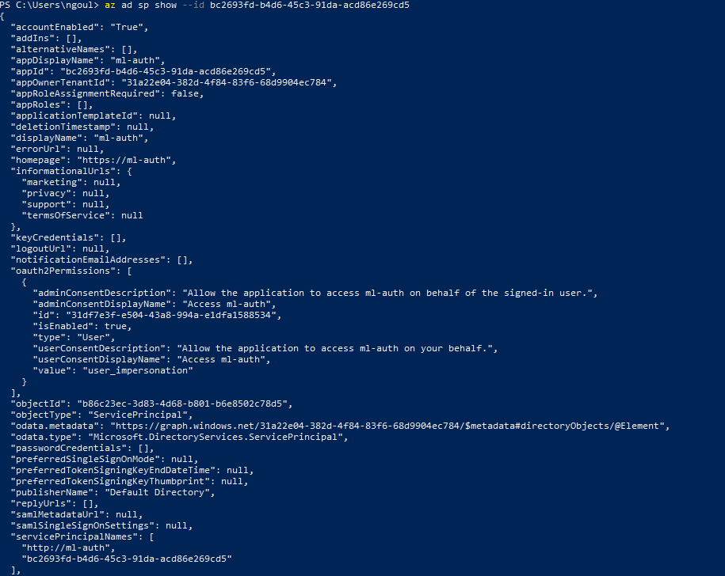


### Getting the data
We get the data to be used from this [link](https://automlsamplenotebookdata.blob.core.windows.net/automl-sample-notebook-data/bankmarketing_train.csv), and save it under the name ``BankMarketing Dataset``.

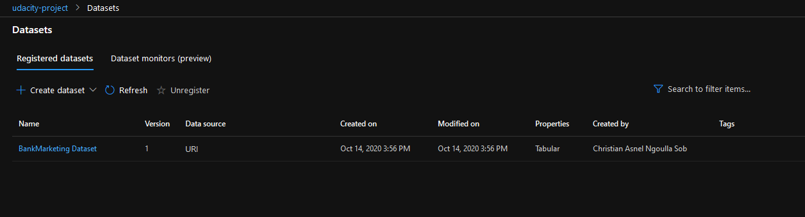
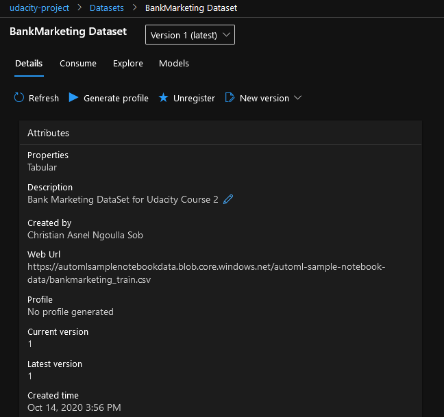


### Setting up the pipeline and Running the experiment


We setup new compute cluster and a pipeline with an automl step configured to run classification with a primary metric of ``AUC_weighted`` on our dataset.

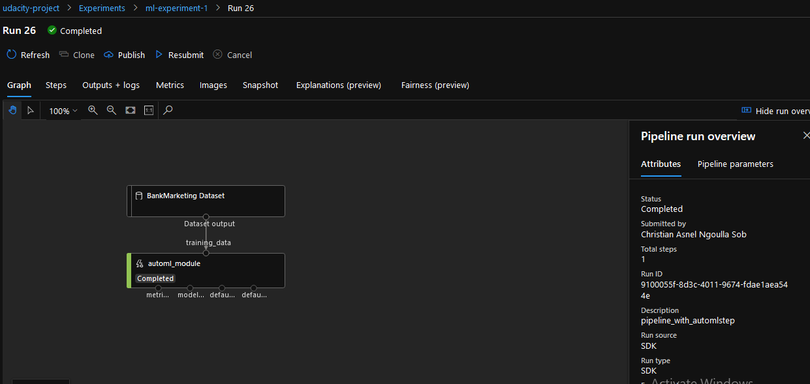
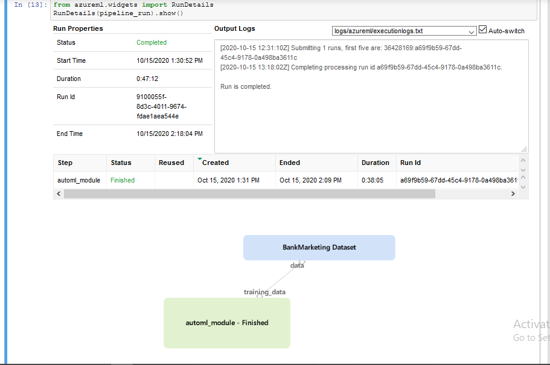

### Selecting the best performing model

Once our automated ML step is completed, we select the best performing model (``MaxAbsScaler, LightGBM``). 

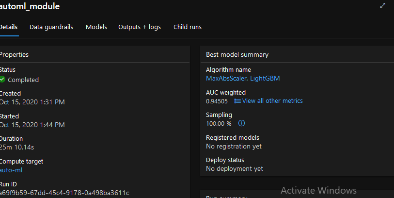
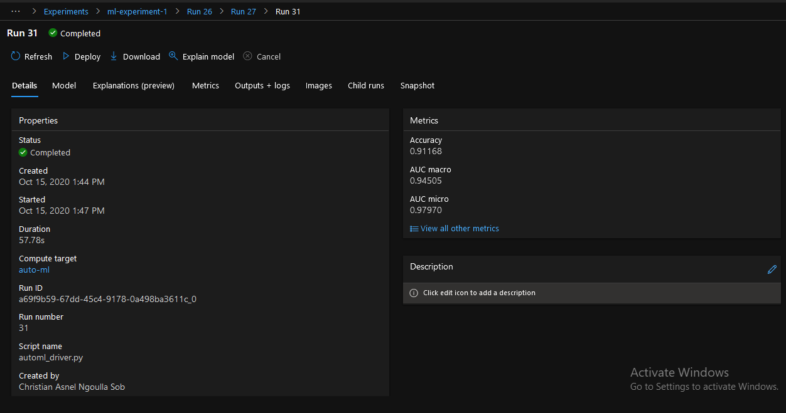

Here are some metrics of the best performing model:

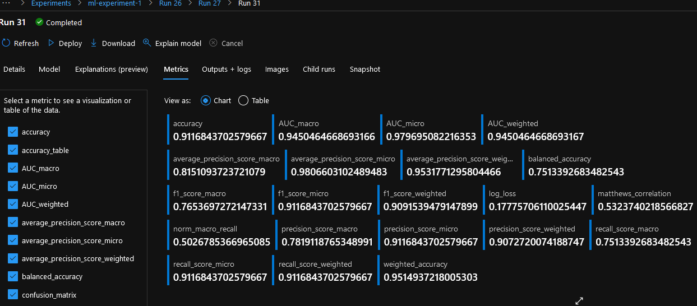


### Deploying the best performing model

We now proceed with deploying the best performing model. We use an ``ACI (azure container instance)`` with ``authentication`` enabled for the deployment.

### Setup logging
We setup login so that we can track the activities on our pipeline. This is particularly useful because it can help us debug errors that may arise (503 for example which is usually the result of an unhandled exception.)

We run the script found in logs.py to enable logging:
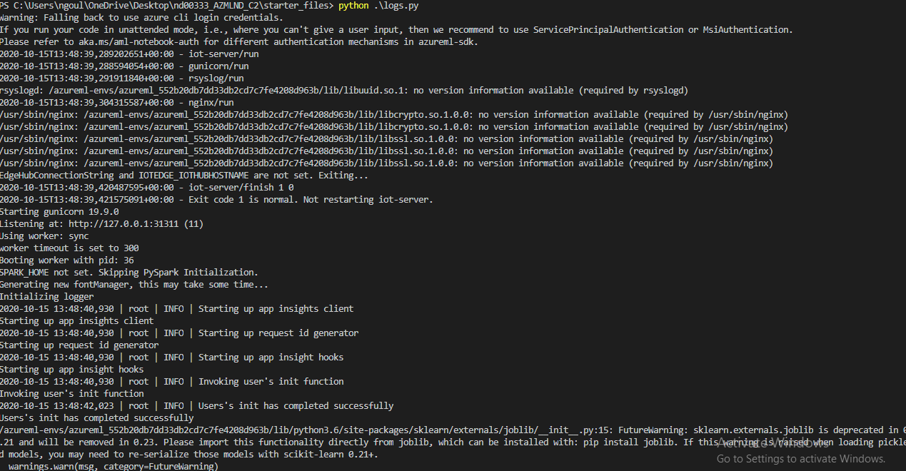
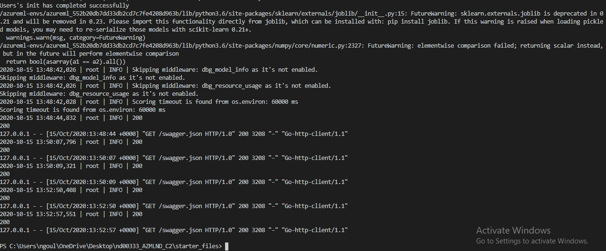

Here we can clearly see that logging as been enabled on our endpoint:
```
Application insigths enabled
true
```

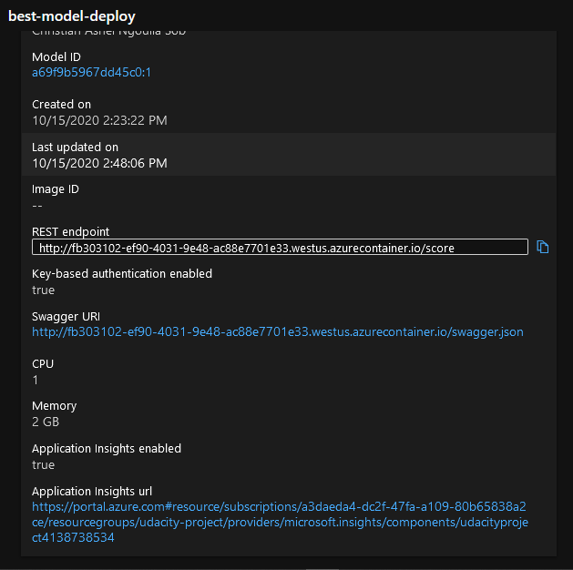

### Endpoint documentation: SWAGGER

Documenting our endpoint is very important. Documentation provide information on the type of requests that can be made on the endpoints available for consumption, the type of input or data expected with a sample.

We get the document from our endpoint which is found in the provided on this [link](http://fb303102-ef90-4031-9e48-ac88e7701e33.westus.azurecontainer.io/swagger.json)

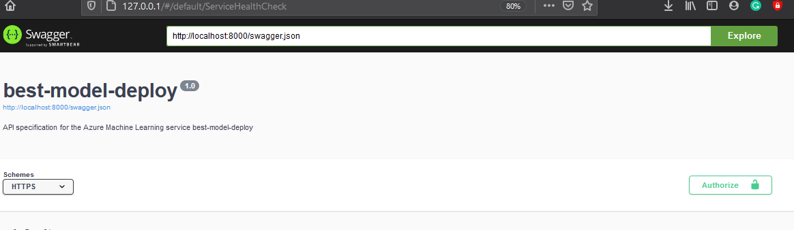
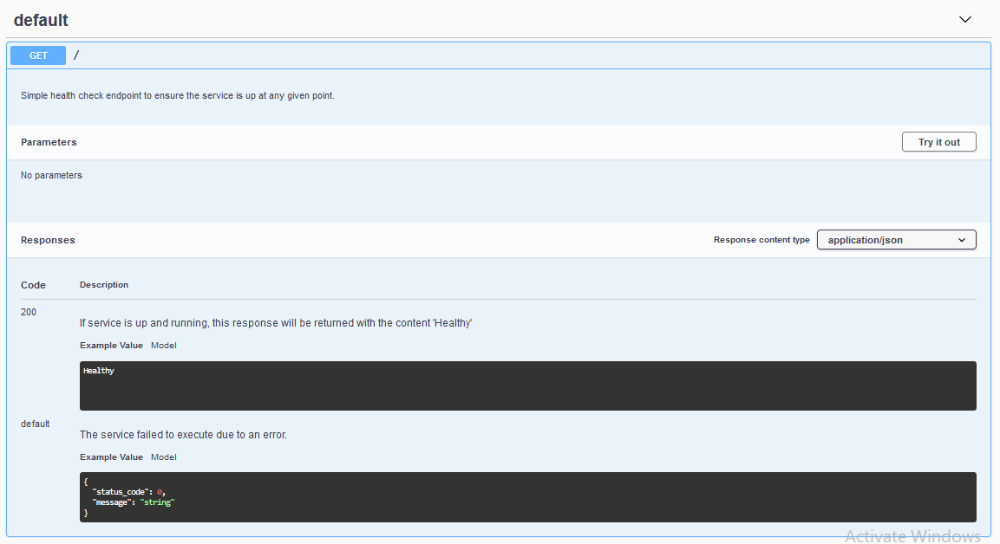
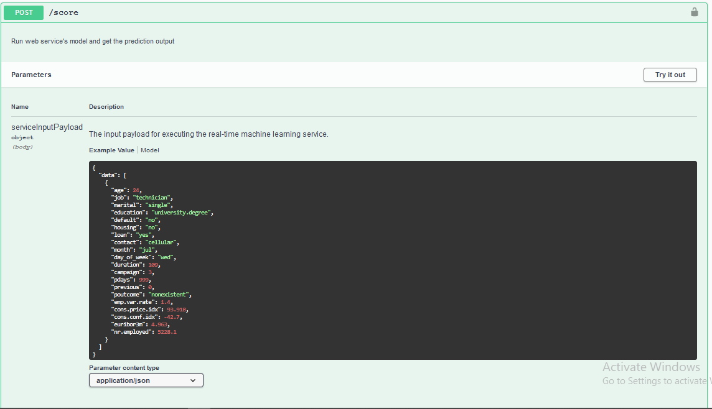
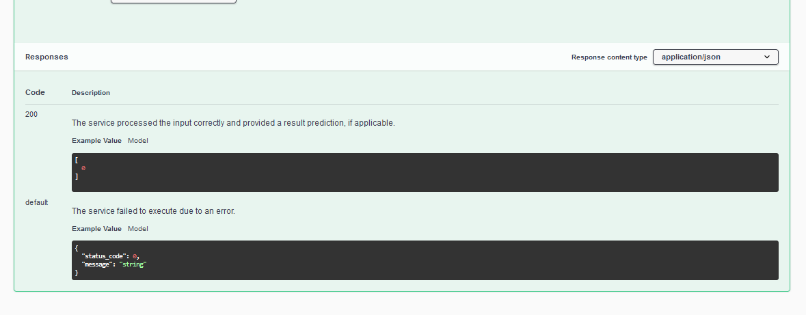

### Consume the endpoint

We modify the script found in ``./endpoint.py`` to consume the endpoint to make prediction. We make post requests to our endpoint with some data to make prediction.
We provide the neccessary key for the request in the header (We have setup our endpoint to require a key for security).
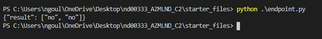


### Define and run an ML pipeline
We get the same data (``BankMarketting Dataset``), we define a pipeline with an automl step for training our data (using classification).

Here is a screenshot showing that our pipeline run has been completed with our dataset and the auto_ml module:


### Publish the pipeline
We go ahead and publish the pipeline as follows:
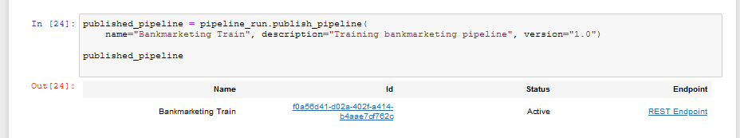

Here are screenshots showing the published pipeline with its active endpoint:
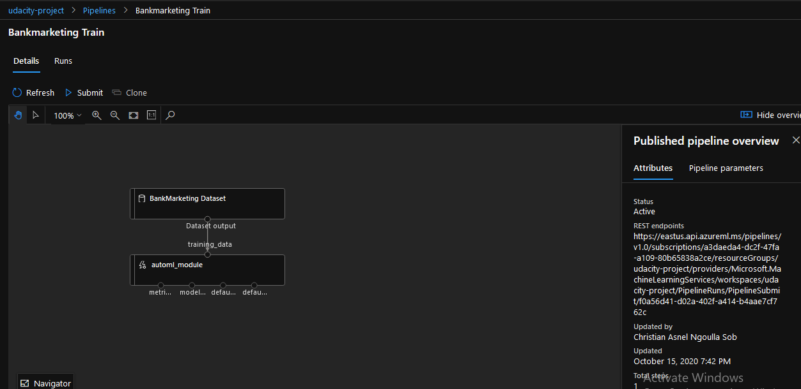
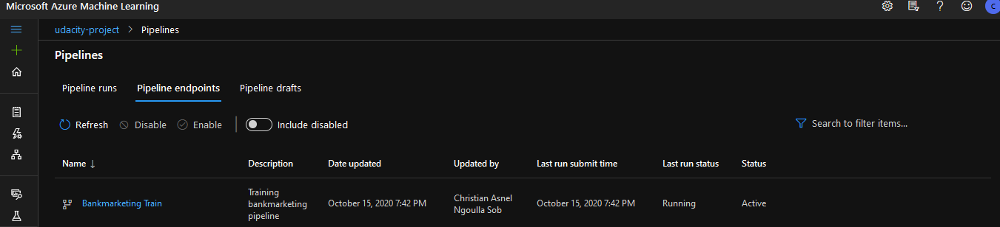


### We consume the publish pipeline

We consume our pipeline, making a post request to our pipeline endpoint with all authentication details in the header, to trigger a run.
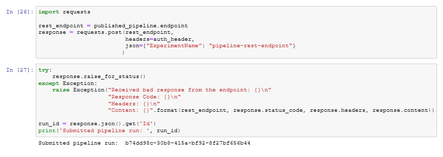

Here are some details about the run:
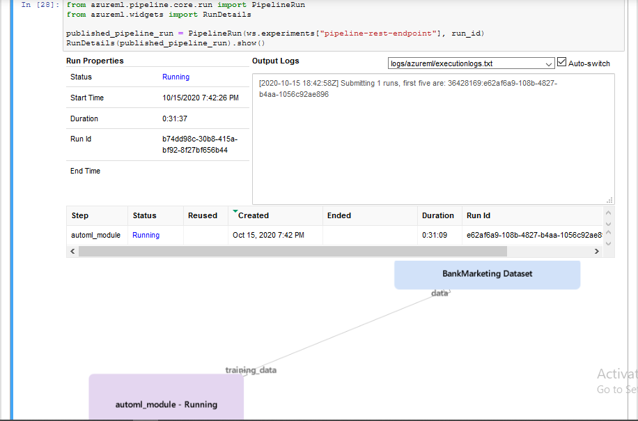


*TODO* Remember to provide screenshots of the `RunDetails` widget as well as a screenshot of the best model trained with it's parameters.

## Screen Recording
*TODO* Provide a link to a screen recording of the project in action. Remember that the screencast should demonstrate:

## Standout Suggestions
*TODO (Optional):* This is where you can provide information about any standout suggestions that you have attempted.
